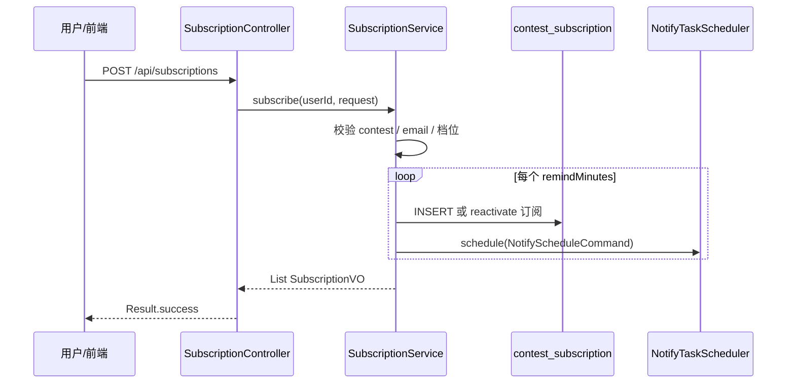

# 模块 3：赛事订阅 — 实施文档

> 用户表达「我要被提醒」；真正写任务、扫任务、发邮件在模块 4  
> 文档版本：v2.0 | 状态：**MVP 已完成（与模块 4 解耦）**

---

## 1. 模块定位（一句话）

**模块 3 只管「订阅关系」**：用户选了哪场比赛、提前多久提醒；订阅成功后通过接口通知模块 4 写 `notify_task`。

| 模块 3 做 | 模块 3 不做 |
|-----------|-------------|
| 订阅 / 取消 / 查我的订阅 API | 定时扫描 `notify_task` |
| 写 `contest_subscription` | 发 SMTP 邮件 |
| 调用 `NotifyTaskScheduler` 接口 | 写 `notify_log` |
| 校验邮箱、赛事、提醒档位 | RabbitMQ / Redis 限流 |

---

## 2. 架构总览

```text
┌─────────────────────────────────────────────────────────────┐
│  module/subscription/          模块 3：订阅意图              │
├─────────────────────────────────────────────────────────────┤
│  controller/SubscriptionController   HTTP 入口               │
│  service/SubscriptionService         业务编排 + 调模块 4 接口  │
│  mapper/ContestSubscriptionMapper    contest_subscription CRUD │
│  entity/dto/vo/config              表映射、请求体、响应、配置   │
└───────────────────────────┬─────────────────────────────────┘
                            │ 仅依赖接口
                            ▼
┌─────────────────────────────────────────────────────────────┐
│  module/notify/writeTask/      模块 4 的「写任务」子块         │
│  api/NotifyTaskScheduler             边界接口（模块 3 唯一触点）│
└─────────────────────────────────────────────────────────────┘
```

### 2.1 每个文件干什么

| 路径 | 类 | 职责 | 测试时看这里 |
|------|-----|------|--------------|
| `controller/SubscriptionController.java` | REST 入口 | `POST/DELETE/GET /api/subscriptions/**` | API 404/401 先看 Controller 路由 |
| `service/SubscriptionService.java` | 核心业务 | 校验 → 写订阅表 → 调 `NotifyTaskScheduler` | 业务报错、没生成 task 先看 Service |
| `mapper/ContestSubscriptionMapper.java` | 数据访问 | `contest_subscription` 增删查 | 表没数据 / 状态不对看 Mapper + XML |
| `entity/ContestSubscriptionEntity.java` | 实体 | 表字段映射 | — |
| `dto/SubscribeRequest.java` | 请求体 | `contestId` + `remindBeforeMinutes[]` | 参数校验失败 |
| `vo/SubscriptionVO.java` | 响应体 | 我的订阅列表展示字段 | 前端列表字段 |
| `config/SubscriptionProperties.java` | 配置 | 允许的提醒档位白名单 `{1440, 60}` | 档位被拒看 `subscription.allowed-remind-minutes` |

**MyBatis XML：** `resources/mapper/ContestSubscriptionMapper.xml`

---

## 3. 与模块 4 的边界

```text
模块 3                              模块 4（notify）
────────                            ────────────────
SubscriptionService                 writeTask/
  │ subscribe()                       NotifyTaskScheduleService
  │   └─ NotifyTaskScheduler.schedule()   INSERT notify_task
  │ cancel()
  │   └─ cancelBySubscriptionId()         UPDATE notify_task → CANCELLED
```

**硬性规则：** `subscription` 包内 **禁止** import `notify.discovery.*` 或 `notify.delivery.*`，只能 import：

```java
import org.fjnu305.acm01.module.notify.writeTask.api.NotifyTaskScheduler;
import org.fjnu305.acm01.module.notify.writeTask.dto.NotifyScheduleCommand;
```

---

## 4. 端到端业务流



### 4.1 订阅 `POST /api/subscriptions`

```text
SubscriptionController.subscribe()
    → SubscriptionService.subscribe()
        ① contestQueryMapper.selectById        # 赛事存在且未开始
        ② userMapper.selectById + email 非空
        ③ 每个 remindMinutes ∈ {1440, 60}
        ④ scheduled_at = start_time - remind   # 已过期档位跳过
        ⑤ contest_subscription INSERT / reactivate（channel=EMAIL）
        ⑥ notifyTaskScheduler.schedule(command)  → 模块 4 写 notify_task
```

### 4.2 取消 `DELETE /api/subscriptions/{id}`

```text
SubscriptionService.cancel()
    → subscription.status = 0
    → notifyTaskScheduler.cancelBySubscriptionId()
        → 模块 4：PENDING 任务标 CANCELLED
```

### 4.3 我的订阅 `GET /api/subscriptions/my`

```text
SubscriptionService.listMySubscriptions()
    → contest_subscription WHERE user_id=? AND status=1
    → JOIN contest 返回 SubscriptionVO
```

---

## 5. 数据库（模块 3 归属）

| 表 | 说明 |
|----|------|
| `contest_subscription` | 订阅意图；`UNIQUE(user_id, contest_id, remind_before_minutes)` |

**建表脚本：** `src/main/resources/db/init-subscription.sql`（含 `notify_task`、`notify_log`，模块 4 使用）

### 5.1 关键字段

| 字段 | 含义 |
|------|------|
| `user_id` | 订阅用户 |
| `contest_id` | 赛事 |
| `remind_before_minutes` | 1440=24h，60=1h |
| `channel` | 固定 `EMAIL` |
| `status` | 1=生效，0=已取消 |

---

## 6. API 速查

| 方法 | 路径 | 说明 |
|------|------|------|
| POST | `/api/subscriptions` | 订阅（需 JWT） |
| DELETE | `/api/subscriptions/{id}` | 取消 |
| GET | `/api/subscriptions/my` | 我的生效订阅 |

### 6.1 请求体

```json
{
  "contestId": 10,
  "remindBeforeMinutes": [1440, 60]
}
```

渠道固定 `EMAIL`，**无需**传 `channel`。

### 6.2 错误码定位

| 现象 | ErrorCode | 查哪里 |
|------|-----------|--------|
| 赛事不存在 | 2001 `CONTEST_NOT_FOUND` | `contest` 表是否有该 id |
| 订阅不存在/非本人 | 2002 `SUBSCRIPTION_NOT_FOUND` | `contest_subscription.id` + `user_id` |
| 档位非法/全部过期 | 2003 `INVALID_REMIND_TIME` | 比赛是否太近；`allowed-remind-minutes` |
| 比赛已开始 | 2004 `CONTEST_ALREADY_STARTED` | `contest.start_time` |
| 未填邮箱 | 2005 `EMAIL_REQUIRED` | `user.email` |

---

## 7. 配置

```yaml
# application.yml
subscription:
  allowed-remind-minutes:
    - 1440
    - 60
```

邮件、扫描、MQ 等均在模块 4，见 [`module-4-notify.md`](module-4-notify.md) §5。

### 7.1 SMTP / Jasypt（收件依赖用户邮箱，发件在模块 4）

| 角色 | 配置 | 说明 |
|------|------|------|
| 收件 | `user.email` | 注册时必填，订阅时校验 |
| 发件 | `spring.mail.*` + `notify.email.*` | 模块 4 `EmailNotifyHandler` 使用 |

本地配置步骤见 §9.3（原 §8.2–8.3）。

---

## 8. 前端（acm01-web）

| 文件 | 作用 |
|------|------|
| `ContestListPage.tsx` | 赛事列表「订阅」弹窗（24h/1h） |
| `MySubscriptionsPage.tsx` | 我的订阅、取消 |
| `api/subscription.ts` | API 客户端 |
| `UserHomePage.tsx` | 入口与测试说明 |

---

## 9. 测试与问题定位（模块 3）

### 9.1 订阅后应出现什么

```sql
-- ① 订阅记录（模块 3）
SELECT id, user_id, contest_id, remind_before_minutes, channel, status
FROM contest_subscription
WHERE user_id = <你的user_id>
ORDER BY id DESC;

-- ② 提醒任务（模块 4 writeTask 写入，此处用于联调确认）
SELECT id, subscription_id, scheduled_at, status, idempotent_key
FROM notify_task
WHERE subscription_id IN (
    SELECT id FROM contest_subscription WHERE user_id = <你的user_id>
)
ORDER BY id DESC;
```

| 检查项 | 正常 | 异常时查 |
|--------|------|----------|
| `contest_subscription` 有行 | `status=1` | `SubscriptionService.subscribe` 是否抛错 |
| `notify_task` 有行 | `status=PENDING`，`scheduled_at` = 开赛时间 − 提醒分钟 | `NotifyTaskScheduleService`；`scheduled_at` 是否已过期被跳过 |
| 幂等键 | `userId:contestId:EMAIL:remindMinutes` | 重复订阅同档位应跳过或 reactivate |

### 9.2 取消后应出现什么

```sql
SELECT status FROM contest_subscription WHERE id = <subscription_id>;  -- 应为 0
SELECT status FROM notify_task WHERE subscription_id = <subscription_id>;  -- PENDING → CANCELLED
```

### 9.3 快速触发邮件（跨模块，改 notify_task）

模块 3 不负责发信；要测邮件需配合模块 4：

```sql
UPDATE notify_task
SET scheduled_at = DATE_SUB(NOW(), INTERVAL 1 MINUTE)
WHERE status = 'PENDING'
LIMIT 1;
```

等约 1 分钟后查 `notify_log`、`notify_task.status`，详见 [`module-4-notify.md`](module-4-notify.md) §8。

### 9.4 本地环境准备

```bash
mvn clean compile
# 数据库顺序：init-contest.sql → init-contest-crawl.sql → init-subscription.sql
# 配置 application-local.yml + JASYPT_ENCRYPTOR_PASSWORD
# 模块 4 还需：Redis、RabbitMQ（默认开启）、SMTP
```

### 9.5 QQ 邮箱 SMTP

1. QQ 邮箱 → 设置 → 账号与安全 → 生成 **授权码**（16 位）
2. `JasyptEncryptTool` 加密 → 写入 `application-local.yml` 的 `spring.mail.password: ENC(...)`
3. 启动时环境变量 `JASYPT_ENCRYPTOR_PASSWORD=主密码`

```powershell
$env:JASYPT_ENCRYPTOR_PASSWORD="主密码"
cd acm01
mvn -q compile exec:java "-Dexec.mainClass=org.fjnu305.acm01.tools.JasyptEncryptTool" "-Dexec.args=16位授权码"
```

---

## 10. 边界情况

| 场景 | 模块 3 行为 |
|------|-------------|
| 比赛已开始 | 拒绝订阅 |
| 某档位提醒时间已过 | 跳过该档位；全过期 → `INVALID_REMIND_TIME` |
| 重复订阅同档位且 status=1 | 跳过，不重复 INSERT |
| 曾取消再订 | `reactivate` 订阅 + 模块 4 reactivate 任务 |
| 取消订阅 | `status=0` + 模块 4 取消 PENDING 任务 |

发信失败、重试、限流、合并邮件等均在模块 4，见 [`module-4-notify.md`](module-4-notify.md)。

---

## 11. 关键设计决策

| 决策 | 说明 |
|------|------|
| 与模块 4 解耦 | 只依赖 `writeTask.api.NotifyTaskScheduler` 接口 |
| 渠道固定 EMAIL | 请求体不传 channel |
| `notify_task` 不冗余 user_id | 发送时经 `subscription_id` JOIN |
| 幂等键 | `userId:contestId:EMAIL:remindMinutes` |

---

## 12. 相关文档

| 文档 | 内容 |
|------|------|
| [`module-4-notify.md`](module-4-notify.md) | writeTask / discovery / delivery 三分块 + 发信测试 |
| [`database-schema.md`](database-schema.md) §4 | 表结构 |
| [`module-2-contest.md`](module-2-contest.md) | 赛事数据 |
| [`architecture-modules.md`](architecture-modules.md) | 全站规划 |
