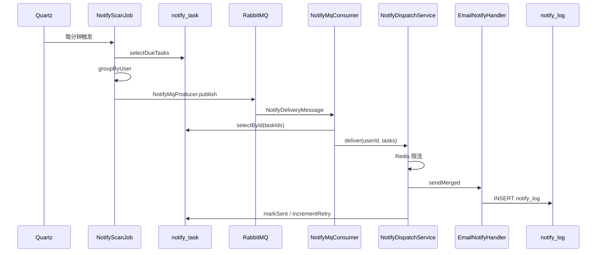

# 模块 4：消息通知 — 实施文档

> 到点了给用户发邮件；内部分 **writeTask → discovery → delivery** 三块  
> 文档版本：v2.1 | 状态：**MVP + A3 增强已完成**

---

## 1. 模块定位（一句话）

**模块 4 负责「提醒任务的完整生命周期」**：订阅时写入任务 → 定时发现到期任务 → 执行发信并记日志。

| 子块 | 时机 | 干什么 |
|------|------|--------|
| **writeTask** | 订阅 / 取消时（模块 3 触发） | 往 `notify_task` **写**未来任务 |
| **discovery** | 每分钟 Quartz | **找**到期任务，按用户分组，交给执行侧 |
| **delivery** | MQ 消费或本地直调 | **发**邮件，更新状态，写 `notify_log` |

---

## 2. 三分块架构图

```text
                    ┌──────────────────────────────────────┐
                    │  writeTask（写任务）                   │
                    │  触发：模块 3 订阅/取消                 │
                    ├──────────────────────────────────────┤
                    │  api/NotifyTaskScheduler      边界接口 │
                    │  dto/NotifyScheduleCommand    传参     │
                    │  service/NotifyTaskScheduleService     │
                    └───────────────┬──────────────────────┘
                                    │ INSERT / UPDATE notify_task
                                    ▼
                              ┌───────────┐
                              │ notify_task│
                              └─────┬─────┘
                                    │ scheduled_at <= NOW()
                                    ▼
                    ┌──────────────────────────────────────┐
                    │  discovery（发现任务）                 │
                    │  触发：Quartz 每分钟                   │
                    ├──────────────────────────────────────┤
                    │  config/NotifyScanQuartzConfig  注册定时器│
                    │  job/NotifyScanJob              扫描入口 │
                    │  api/NotifyDeliveryPublisher    边界接口 │
                    │  publisher/NotifyMqProducer       MQ 投递  │
                    │  publisher/LocalNotifyDeliveryPublisher  │
                    │         （mq=false 时本地直调）           │
                    └───────────────┬──────────────────────┘
                                    │ publish(userId, tasks)
                         mq=true   │              mq=false
                    ┌──────────────┴──────────────┐
                    ▼                             ▼
              RabbitMQ                    LocalNotifyDeliveryPublisher
                    │                             │
                    └──────────────┬──────────────┘
                                   ▼
                    ┌──────────────────────────────────────┐
                    │  delivery（执行任务）                  │
                    ├──────────────────────────────────────┤
                    │  consumer/NotifyMqConsumer      MQ 入口 │
                    │  service/NotifyDispatchService  编排+限流│
                    │  emailhandler/EmailNotifyHandler 发SMTP│
                    └───────────────┬──────────────────────┘
                                    ▼
                         notify_log + notify_task 状态更新
```

---

## 3. 包结构与文件职责（详细）

```text
org.fjnu305.acm01.module.notify/
│
├── writeTask/                         # 块 A：写任务（订阅触发）
│   ├── api/NotifyTaskScheduler.java
│   ├── dto/NotifyScheduleCommand.java
│   └── service/NotifyTaskScheduleService.java
│
├── discovery/                         # 块 B：发现任务（定时触发）
│   ├── api/NotifyDeliveryPublisher.java
│   ├── config/NotifyScanQuartzConfig.java
│   ├── job/NotifyScanJob.java
│   └── publisher/
│       ├── NotifyMqProducer.java
│       └── LocalNotifyDeliveryPublisher.java
│
├── delivery/                          # 块 C：执行任务（发信）
│   ├── consumer/NotifyMqConsumer.java
│   ├── service/NotifyDispatchService.java
│   ├── emailhandler/EmailNotifyHandler.java
│   └── websockethandler/WebSocketNotifyHandler.java
│
├── config/                            # 共享配置
│   ├── NotifyProperties.java
│   └── NotifyRabbitConfig.java
├── dto/NotifyDeliveryMessage.java       # discovery → delivery 的 MQ 消息体
├── entity/                            # NotifyTaskEntity, NotifyLogEntity
└── mapper/                            # NotifyTaskMapper, NotifyLogMapper
```

**MyBatis XML：** `resources/mapper/NotifyTaskMapper.xml`、`NotifyLogMapper.xml`

---

### 3.1 writeTask — 每个文件

| 文件 | 职责 | 输入 | 输出 / 副作用 |
|------|------|------|----------------|
| `NotifyTaskScheduler` | 对外接口；模块 3 唯一入口 | `schedule` / `cancelBySubscriptionId` / `rescheduleByContestId` | — |
| `NotifyScheduleCommand` | 传参 DTO | subscriptionId, userId, contestId, channel, remindMinutes, contestStartTime | — |
| `NotifyTaskScheduleService` | 实现登记逻辑 | Command | `INSERT notify_task` 或 reactivate / cancel |

**schedule() 逻辑：**

```text
scheduled_at = contestStartTime - remindBeforeMinutes
若 scheduled_at <= now → 直接 return（不写任务）
idempotent_key = userId:contestId:channel:remindMinutes
已存在且 CANCELLED → reactivate
否则 INSERT（status=PENDING, retry_count=0）
```

**cancelBySubscriptionId()：**

```text
UPDATE notify_task SET status='CANCELLED'
WHERE subscription_id=? AND status='PENDING'
```

**rescheduleByContestId()（A3 — 爬虫改期）：**

```text
触发：ContestPersistService.persistAll 检测到 start_time 变更
1. selectActiveByContestId(contestId)
2. 对每个 subscription 的 PENDING 任务：
   newScheduledAt = newContestStartTime - remindBeforeMinutes
   若 newScheduledAt <= now → cancelById
   否则 → updateScheduledAt
```

**测试定位：** 订阅后没有 `notify_task` → 先看 `scheduled_at` 是否已过期，再看 `NotifyTaskScheduleService`。

---

### 3.2 discovery — 每个文件

| 文件 | 职责 | 何时运行 | 测试定位 |
|------|------|----------|----------|
| `NotifyScanQuartzConfig` | 注册 Quartz Job，cron 来自 `notify.scan-cron` | 应用启动 | Job 不跑 → 配置 / `notify.enabled` |
| `NotifyScanJob` | 扫描入口：捞到期任务 → 按 user 分组 → publish | 默认每分钟 | 日志：`Notify scan job dispatching N user batch(es)` |
| `NotifyDeliveryPublisher` | 发现→执行 边界接口 | — | — |
| `NotifyMqProducer` | `mq.enabled=true`：发 RabbitMQ | ScanJob 循环内 | 日志：`Published notify delivery for user`；需 RabbitMQ |
| `LocalNotifyDeliveryPublisher` | `mq.enabled=false`：同进程调 delivery | ScanJob 循环内 | 无需 RabbitMQ |

**NotifyScanJob 内部步骤：**

```text
1. notifyTaskMapper.selectDueTasks(batchSize)
   WHERE status IN ('PENDING','FAILED') AND scheduled_at <= NOW()
2. groupByUser()：经 subscription_id → contest_subscription.user_id 分组
3. deliveryPublisher.publish(userId, tasks)
4. Thread.sleep(send-interval-millis)   # 用户批次间间隔
```

**测试定位：** 任务到期但没发信 → 先确认 ScanJob 日志有没有；再查 RabbitMQ 队列（mq=true）或 delivery 日志。

---

### 3.3 delivery — 每个文件

| 文件 | 职责 | 测试定位 |
|------|------|----------|
| `NotifyMqConsumer` | 从 MQ 收 `NotifyDeliveryMessage`，按 taskId 回查，调 dispatch | 队列堆积 → Consumer 是否启动 |
| `NotifyDispatchService` | **执行总入口**：Redis 限流 → 校验状态 → 发信 → 更新任务 | 限流 / 重试 / markSent 在此 |
| `EmailNotifyHandler` | 拼邮件 UTF-8、调 SMTP、写 `notify_log` | 乱码 / SMTP 失败看 `notify_log.error_message` |
| `WebSocketNotifyHandler` | 在线用户 STOMP 推送、写 `notify_log` | 用户离线记 SKIPPED；见 [`module-5-websocket.md`](module-5-websocket.md) |

**NotifyDispatchService.deliver() 流程：**

```text
1. acquireRateLimit(userId)     # Redis key: notify:rate:{userId}，默认 60s
2. processUserBatch(tasks)
   ├─ 刷新任务状态，只处理 PENDING / FAILED
   ├─ 按 channel 分组：EMAIL → sendMerged；WEBSOCKET → WebSocketNotifyHandler
   ├─ 成功 → markSent（按渠道独立）
   └─ 失败 → incrementRetryWithBackoff 或 markFailed（指数退避，超 max-retries）
```

---

### 3.4 共享层

| 文件 | 职责 |
|------|------|
| `NotifyProperties` | 读取 `notify.*` 全部配置 |
| `NotifyRabbitConfig` | `mq.enabled=true` 时声明 exchange / queue / binding |
| `NotifyDeliveryMessage` | MQ 消息：`userId` + `taskIds[]` |
| `NotifyTaskMapper` / `NotifyLogMapper` | 数据库操作 |
| `NotifyTaskEntity` / `NotifyLogEntity` | 表映射 |

---

## 4. 与模块 3 的边界

```text
模块 3 SubscriptionService
    │ schedule(NotifyScheduleCommand)
    ▼
writeTask/NotifyTaskScheduleService  →  notify_task 表

（时间流逝，scheduled_at 到期）

discovery/NotifyScanJob  →  publisher  →  delivery/NotifyDispatchService  →  邮件
```

**硬性规则：** 模块 3 只能 import：

```java
import org.fjnu305.acm01.module.notify.writeTask.api.NotifyTaskScheduler;
import org.fjnu305.acm01.module.notify.writeTask.dto.NotifyScheduleCommand;
```

| 表 / 配置 | 归属 |
|-----------|------|
| `contest_subscription` | 模块 3 |
| `notify_task`、`notify_log` | 模块 4 |
| `subscription.allowed-remind-minutes` | 模块 3 |
| `notify.*` | 模块 4 |

---

## 5. 完整运行时序（mq.enabled=true，默认）



---

## 6. 配置说明

### 6.1 `application.yml`

```yaml
notify:
  enabled: true
  scan-cron: "0 */1 * * * ?"       # 扫描频率，默认每分钟
  scan-batch-size: 200             # 每轮最多捞多少条到期任务
  max-retries: 3                   # 发信失败重试上限
  send-interval-millis: 1000       # discovery：用户批次之间的 sleep
  retry:
    base-delay-seconds: 30         # 失败重试指数退避基数（30s, 60s, 120s…）
  mq:
    enabled: true                  # true=RabbitMQ；false=本地直调 delivery
    exchange: notify.exchange
    queue: notify.delivery.queue
    routing-key: notify.delivery
  rate-limit:
    user-min-interval-seconds: 60  # delivery：同用户最短发信间隔（Redis）
  email:
    enabled: false                 # 本地在 application-local.yml 改 true
    from: ${MAIL_FROM:noreply@acmer.local}

spring:
  data.redis:                      # 限流依赖
    host: localhost
    port: 6379
  rabbitmq:                        # mq.enabled=true 时必需
    host: localhost
    port: 5672
  mail:
    default-encoding: UTF-8
```

### 6.2 `application-local.yml`（不提交 Git）

完整 SMTP 模板见 **`application-local.yml.example`**（含 host/port/username/ENC 密码）。

```yaml
notify:
  email:
    enabled: true
    from: 你的QQ号@qq.com

spring:
  mail:
    host: smtp.qq.com
    port: 587
    username: 你的QQ号@qq.com
    password: ENC(...)
```

SMTP 与 Jasypt 配置步骤见 [`module-3-subscription.md`](module-3-subscription.md) §9.3。

### 6.3 外部依赖矩阵

| 功能 | 依赖 | 未启动时现象 |
|------|------|--------------|
| 写任务 | MySQL | 订阅成功但无 notify_task |
| 扫描 | Quartz（内置） | 无 `Notify scan job` 日志 |
| MQ 投递 | RabbitMQ（`mq.enabled=true`） | 启动失败或 publish 异常 |
| 限流 | Redis | `NotifyDispatchService` Redis 报错 |
| 发信 | SMTP + `notify.email.enabled=true` | `notify_log` FAILED |

### 6.4 关闭 RabbitMQ（本地简化）

```yaml
notify:
  mq:
    enabled: false
```

此时 `LocalNotifyDeliveryPublisher` 生效，ScanJob 直接调 `NotifyDispatchService`，无需 RabbitMQ。

---

## 7. 邮件格式

| 场景 | 主题 | 正文 |
|------|------|------|
| 1 场 | `[ACMer] 赛前提醒 - {title}` | 平台 / 赛事 / 开始时间 / 提醒 / 链接 |
| N 场 | `[ACMer] 赛前提醒 - N 场比赛` | 多段，段间 `--- 第 N 条 ---` |

---

## 8. 测试与问题定位（按块）

### 8.1 总览：从现象到块

| 现象 | 先查哪块 | 关键 SQL / 日志 |
|------|----------|-----------------|
| 订阅后无任务 | **writeTask** | `SELECT * FROM notify_task WHERE subscription_id=?` |
| 任务到期不发 | **discovery** | 日志 `Notify scan job dispatching` |
| MQ 有消息不发信 | **delivery** consumer | RabbitMQ 队列；Consumer 异常日志 |
| 邮件内容/SMTP 错 | **delivery** emailhandler | `notify_log.error_message` |
| 同用户应合并 | discovery 分组 + delivery 合并 | 同 user 多条 PENDING 一批 |
| 60s 内连收多封 | **delivery** 限流 | Redis `notify:rate:{userId}` |

---

### 8.2 writeTask 测试

```sql
SELECT t.id, t.subscription_id, t.scheduled_at, t.status, t.idempotent_key,
       s.user_id, s.contest_id, s.remind_before_minutes
FROM notify_task t
JOIN contest_subscription s ON t.subscription_id = s.id
WHERE s.user_id = <user_id>
ORDER BY t.id DESC;
```

| 检查 | 预期 |
|------|------|
| `status` | `PENDING` |
| `scheduled_at` | `contest.start_time - remind_before_minutes` |
| `idempotent_key` | `{userId}:{contestId}:EMAIL:{remindMinutes}` |

取消订阅后：`PENDING` → `CANCELLED`。

---

### 8.3 discovery 测试

**快速让任务到期：**

```sql
UPDATE notify_task
SET scheduled_at = DATE_SUB(NOW(), INTERVAL 1 MINUTE)
WHERE status = 'PENDING'
LIMIT 1;
```

约 1 分钟后检查：

1. 后端日志：`Notify scan job dispatching X user batch(es)...`
2. mq=true：`Published notify delivery for user ...`
3. RabbitMQ 队列 `notify.delivery.queue` 应被消费

**合并邮件（同用户多条）：**

```sql
UPDATE notify_task t
JOIN contest_subscription s ON t.subscription_id = s.id
SET t.scheduled_at = DATE_SUB(NOW(), INTERVAL 1 MINUTE)
WHERE t.status = 'PENDING' AND s.user_id = <user_id>;
```

预期一封邮件，正文含 `--- 第 N 条 ---`。

---

### 8.4 delivery 测试

```sql
SELECT id, notify_task_id, user_id, target, status, error_message, created_time
FROM notify_log ORDER BY created_time DESC LIMIT 10;

SELECT id, status, sent_at, retry_count, error_message
FROM notify_task WHERE id IN (<task_ids>);
```

| notify_log.status | 含义 |
|-------------------|------|
| SUCCESS | 已发出，查收件箱 |
| FAILED | 看 `error_message` |

**常见 error_message：**

| 消息 | 原因 |
|------|------|
| `Email notify disabled in config` | `notify.email.enabled=false` |
| `JavaMailSender not configured` | 未配 `spring.mail` |
| `User email not found` | `user.email` 为空 |
| `Subscription not found` | subscription 不存在 |
| `Contest not found` | contest 不存在 |

---

### 8.5 任务状态机

```text
PENDING ──发信成功──► SENT
   │
   ├──发信失败且 retry < max──► PENDING（retry_count++，scheduled_at 推迟退避）
   │
   ├──发信失败且 retry >= max──► FAILED
   │
   └──取消订阅──► CANCELLED
```

---

## 9. 关键设计决策

| 决策 | 说明 |
|------|------|
| 三分块 | writeTask / discovery / delivery 对应写、找、发 |
| 模块 3 只碰 writeTask.api | 发现与执行对 subscription 不可见 |
| 按 user 合并 | ScanJob 分组 + `sendMerged` 一封多段 |
| MQ 默认开启 | 发现与执行解耦；可 `mq.enabled=false` 本地简化 |
| 限流在 DispatchService | Redis `notify:rate:{userId}`，默认 60s |
| 渠道 | EMAIL + WEBSOCKET（订阅时双任务） |
| 改期重算 | 爬虫 persist 后 `rescheduleByContestId` |
| 失败重试 | 指数退避 `retry.base-delay-seconds` |
| 幂等 | `idempotent_key` + `markSent` 乐观锁 |

---

## 10. 后续迭代

| 优先级 | 事项 |
|--------|------|
| P1 | 生产 SMTP 监控 |
| P2 | 社交动态 / 组队邀请推送（模块 6、7） |
| ~~P2~~ | ~~`start_time` 变更后重算 `scheduled_at`~~ ✅ v2.1 |
| ~~P3~~ | ~~站内消息 / WebSocket 第二渠道~~ ✅ 见 [`module-5-websocket.md`](module-5-websocket.md) |

---

## 11. 相关文档

| 文档 | 内容 |
|------|------|
| [`module-3-subscription.md`](module-3-subscription.md) | 订阅 API、边界调用方 |
| [`database-schema.md`](database-schema.md) §4.3–4.4 | `notify_task`、`notify_log` |
| [`module-5-websocket.md`](module-5-websocket.md) | WebSocket 推送、前端 STOMP |
| [`architecture-modules.md`](architecture-modules.md) | 全站模块规划 |
